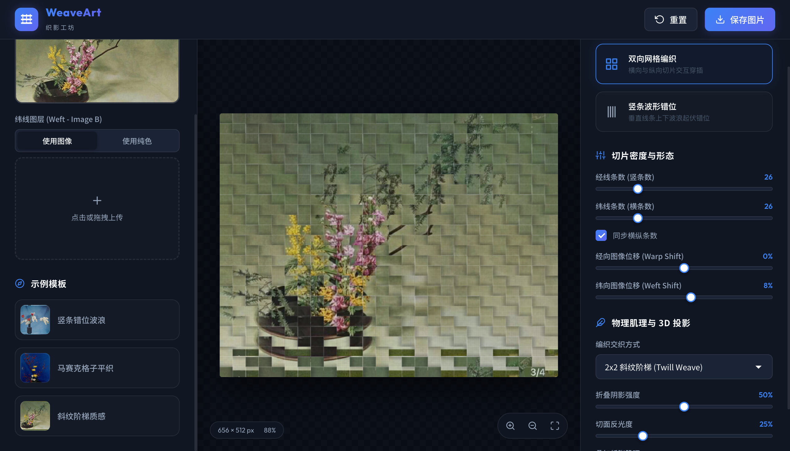

# 织影 WeaveArt

> **网页版数字化照片编织（Photo Weaving）与图像解构艺术工坊**

---

### 🔗 在线演示
[👉 访问 WeaveArt 网页版 Demo 👈](https://holynova.github.io/cut_and_remix/)

---

## 📸 界面预览 (Demo Preview)



---

## ✨ 核心功能

* **网格编织 (Grid Weave)**：纵横纸条交错，支持 **平纹 (1x1)**、**斜纹 (2x2 / 3x3)** 等多种织法。支持双图混织或单图与纯色卡纸穿插。
* **波浪错位 (Wave Shift)**：将图像进行垂直等宽切片，通过正弦波、交替、锯齿或随机噪音算法实现错位位移。
* **3D 拟真质感**：动态渲染层级重叠 **折叠阴影** 与纸张 **切口高光**，程序化叠加 **哑光特种纸、画布、亚麻** 等纸张肌理。
* **极简交互**：支持画布鼠标滚轮缩放、左键拖拽平移，一键载入样例自动匹配最佳参数，支持高清 PNG 导出。

---

## 🚀 本地快速启动

项目由纯静态前端技术开发，不依赖任何第三方重量级框架，可使用任意静态服务器运行：

```bash
# Node.js 启动
npx http-server -p 8080

# 或 Python 3 启动
python3 -m http.server 8080
```

打开浏览器访问 [http://127.0.0.1:8080](http://127.0.0.1:8080) 即可使用。
